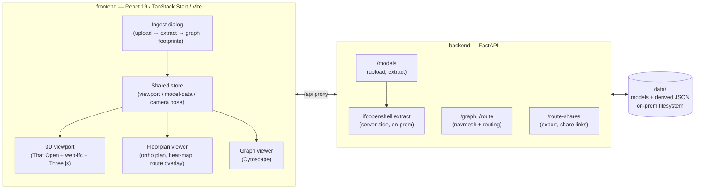

# INFER

**Intelligent Navigation and Facility Environment Reasoning**

Turns static building models (IFC / IndoorGML) into an executable indoor spatial model — a routable navmesh with a connectivity graph, multi-storey pathfinding, and evacuation-load analysis — surfaced through a 3D viewer, floorplan, and graph explorer.

[](backend)
[](backend)
[](frontend)
[](frontend)
[](frontend)
[](#roadmap)
[](#license--distribution)

---

## Overview

INFER is a government-facility internship POC that converts BIM/GIS building data into something a routing engine can actually reason about:

- **Ingest** IFC or IndoorGML files server-side (`ifcopenshell`) into a normalized, versioned schema — storeys, spaces, doors, stairs, lifts, exit candidates.
- **Build** a space–door–vertical-circulation connectivity graph, then a per-storey navmesh, stitched across floors via stairs/lifts.
- **Route** shortest paths across multiple storeys, and compute building-wide evacuation load to surface bottlenecks (worst doors/stairs by occupant flow).
- **Visualize** all of the above across three synchronized panes — a real 3D viewport (That Open + web-ifc), an orthographic floorplan with heat-mapped bottlenecks, and a graph explorer (Cytoscape) — plus shareable/exportable route scenes (USDZ, for AR handoff).

AI-derived inferences (e.g. exit-candidate heuristics) are always labeled as inferred, never silently rewrite the source model, and every navigation entity traces back to its IFC GUID.

## Architecture



## Tech stack

| Layer | Choice |
| --- | --- |
| Backend API | Python 3.11, FastAPI, `ifcopenshell`, `networkx` |
| Frontend | React 19, TypeScript, TanStack Start/Router, Vite |
| 3D / BIM rendering | That Open Components + Fragments, `web-ifc`, Three.js |
| Graph visualization | Cytoscape |
| Styling | Tailwind CSS 4, Radix UI primitives |
| Storage (POC) | Local filesystem, on-prem only |

## Getting started

Requires **Python 3.11+** and **Node 20+**. Two processes, run in separate terminals.

### Backend

```powershell
cd backend
python -m venv .venv
.\.venv\Scripts\Activate.ps1
pip install -r requirements.txt
copy .env.example .env
uvicorn app.main:app --host 127.0.0.1 --port 8000 --reload
```

- Health check: http://127.0.0.1:8000/health
- Interactive API docs: http://127.0.0.1:8000/docs

### Frontend

```powershell
cd frontend
npm install
npm run dev
```

Open the app, click **Open model…**, and drop an `.ifc` or IndoorGML file. Vite proxies `/api` to the backend on `:8000`.

## Project structure

```
INFER/
├─ backend/           FastAPI service — ingest, graph, routing, route-shares
│  ├─ app/
│  │  ├─ ingest/      IFC/IndoorGML → normalized schema
│  │  ├─ routers/      /models, /routing, /route_shares
│  │  └─ services/     storage, derived-artifact persistence
│  └─ tests/
├─ frontend/          React app — 3D / floorplan / graph panes
│  └─ src/
│     ├─ components/  viewer, floorplan, graph, ingest, workspace panes
│     ├─ lib/          navmesh, routing, coordinate-lifting, export
│     ├─ state/        cross-pane shared store
│     └─ viewer/       That Open runtime, floorplan runtime
├─ data/              On-prem model + derived-artifact storage (gitignored)
├─ docs/              Design notes, research, progress logs
└─ openspec/          Spec-driven change proposals (see below)
```

## Core capabilities

- **Multi-format ingest** — IFC (via `ifcopenshell`) and IndoorGML, both producing the same footprints/graph contract.
- **Multi-storey navmesh routing** — per-storey navmeshes stitched across floors through stairs/lifts, sorted and linked by elevation for correct, efficient shortest paths.
- **Evacuation load analysis** — building-wide occupant-flow simulation surfaced as a ranked bottleneck list with units and methodology, and as glowing heat-mapped markers in the 3D scene.
- **Camera-driven storytelling** — clicking a bottleneck flies the 3D camera to that door/stair instead of just jumping the 2D view.
- **Route sharing & export** — generate shareable route links and export scenes to USDZ for AR handoff, built on fragments' async geometry API rather than the live render scene.
- **Responsive under scale** — expensive recomputation (evacuation load, blockage toggles) runs through `useTransition` so large buildings stay interactive.

## API summary

| Method | Path | Purpose |
| --- | --- | --- |
| `POST` | `/models` | Upload an IFC/IndoorGML file |
| `POST` | `/models/{id}/extract` | Run semantic extract, persist JSON |
| `GET` | `/models/{id}/entities` | Fetch persisted extract |
| `POST` | `/models/{id}/graph` | Build connectivity graph |
| `GET` | `/models/{id}/graph` | Fetch persisted graph |
| `GET`/`POST` | `/models/{id}/footprints` | 2D space polygons + door portals |
| `POST` | `/route-shares` | Create a shareable route/export scene |

Full detail: [`backend/README.md`](backend/README.md) · [`frontend/README.md`](frontend/README.md)

## Testing

```powershell
# Backend
cd backend
pytest

# Frontend
cd frontend
npm test
```

## Security & data handling (government POC)

- API binds to `127.0.0.1` by default; set `CORS_ORIGINS` explicitly for any external frontend origin.
- IFC/BIM models are treated as sensitive and stay on-prem under `data/` — never uploaded to cloud BIM SaaS or public LLM APIs.
- Dependencies are pinned; prefer permissive OSS licenses (MIT/MPL/LGPL) with legal review, flag AGPL and proprietary SaaS.
- AI-derived inferences are always labeled as inferred and validated deterministically — the source IFC is never modified.

## Roadmap

Spec-driven planning lives under [`openspec/`](openspec) (proposals in `openspec/changes/`). Current focus: full evacuation-routing at scale, dynamic reroute on blockage, and a navigation-readiness report.

## License & distribution

Internal government proof-of-concept. Not licensed for external distribution.
